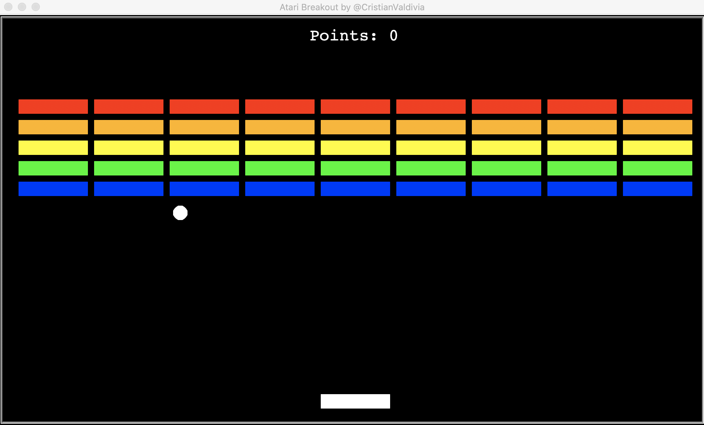

# Atari_Breakout
Versión para comprobar un algoritmo de 'Reinforcement learning' para jugar el popular juego de Atari: Atari Breakout lanzado en 1976. Este juego fue uno de los primeros que el equipo de Google DeepMind empezo a practicar sus algoritmos de aprendizaje.

## Next updates
* Implementar algoritmo de 'Reinforcement learning' para 'aprender' a ganar en el juego.